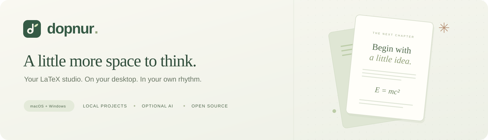
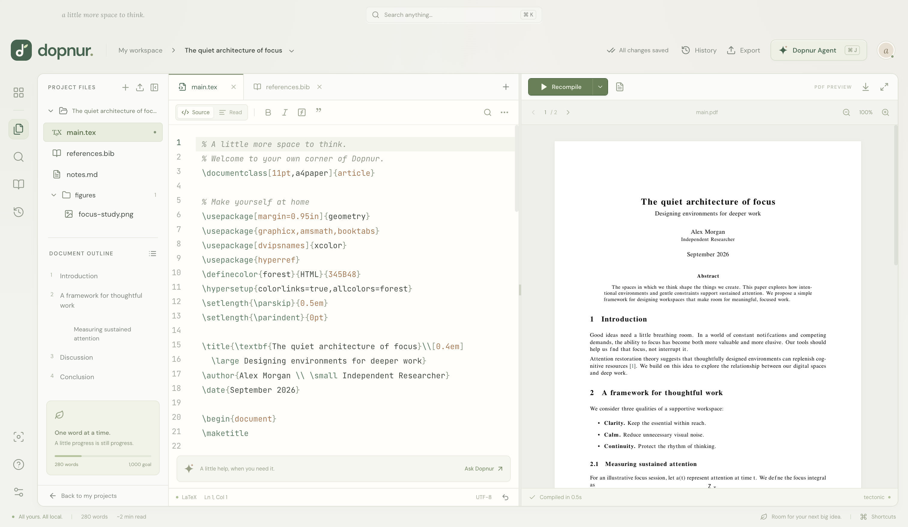
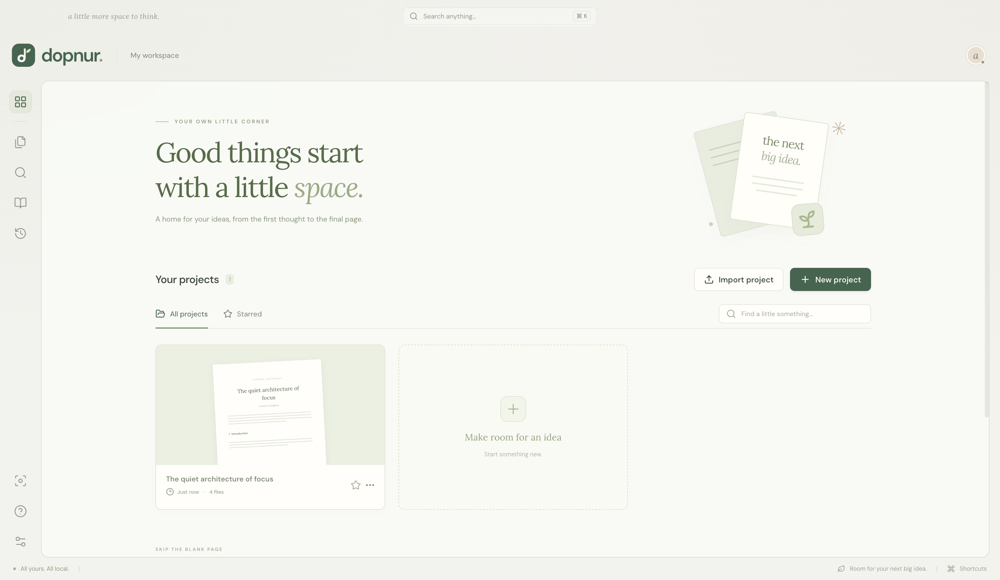

<p align="center">
  
</p>

<p align="center">
  <strong>A thoughtful home for your next paper, thesis, or little idea.</strong><br />
  Write LaTeX, compile beautiful PDFs, and bring in an AI companion when you need one.
</p>

<p align="center">
  <a href="https://github.com/Aeshan-Rosa/Dopnur/actions/workflows/desktop.yml"></a>
  <a href="LICENSE"></a>
  
  
</p>

<p align="center">
  <a href="#get-dopnur">Get Dopnur</a> ·
  <a href="#a-place-for-the-whole-document">Features</a> ·
  <a href="#meet-dopnur-agent">Dopnur Agent</a> ·
  <a href="#run-from-source">Run from source</a> ·
  <a href="docs/DEVELOPMENT.md">Developer guide</a>
</p>

---

Dopnur is a **downloadable desktop LaTeX editor** for macOS and Windows. It brings a familiar source-and-PDF workspace to your computer, with local projects, a real TeX compiler, and a warm glass interface in ivory, sage, and forest green.

No Dopnur account is required. Your project library lives on your machine. AI is optional, and you choose the connection: an authenticated Codex or Claude CLI, your own API key, or a compatible local model server.

<a href="docs/screenshots/workspace.png">
  
</a>
<p align="center"><sub>The real desktop app, with a locally compiled PDF. Click any screenshot to see it in full resolution.</sub></p>

## A place for the whole document

| | What you can do |
| :--- | :--- |
| **Write comfortably** | LaTeX highlighting, autocomplete, bracket matching, folding, search and replace, tabs, and a document outline. |
| **See your pages** | Compile with bundled Tectonic, inspect errors and logs, resize the source/PDF split, and navigate or zoom the preview. |
| **Bring your work along** | Import an Overleaf source ZIP or a local folder, add images and nested files, then export your source ZIP or finished PDF. |
| **Keep references close** | Search your BibTeX entries, paste new references, and insert citations into the editor. |
| **Keep earlier drafts** | Autosave, up to 30 local revision snapshots, and a backup before restoring a version or applying agent edits. |
| **Find your rhythm** | Light and dark appearances, a command palette, focus mode, a session timer, and a document word goal. |
| **Start somewhere lovely** | Research article, blank document, thesis, and letter templates, plus stars and a local project library. |

### Your own little corner

Keep projects together, pick up a recent draft, or begin with a template.

<a href="docs/screenshots/library.png">
  
</a>

## Meet Dopnur Agent

A second pair of eyes, right beside your document. Ask for help with an equation, a clearer paragraph, or a compilation error. Dopnur shows proposed changes in a diff so you can choose what to apply.

<a href="docs/screenshots/agent.png">
  
</a>

| Connection | How it works |
| :--- | :--- |
| **Codex CLI** | Uses your installed CLI and its saved login. No API key needs to be added to Dopnur; your account's eligibility and usage limits apply. |
| **Claude CLI** | Uses your installed Claude Code CLI and saved login, subject to that account's limits. |
| **Your API key** | Connect through OpenAI Responses or an OpenAI-compatible Chat Completions endpoint. Your provider's API billing applies. |
| **Local model** | Connect a compatible localhost model server using Chat Completions. |

1. Open **Dopnur Agent → connection settings** and choose a provider.
2. Ask for help. Dopnur sends the current project's text context and relevant diagnostics to that provider.
3. Review the proposed file changes and apply the ones you want. Dopnur saves a revision first and rejects changes if the original file has since been edited.

Nothing is sent to an AI provider simply by opening or editing a project. CLI mode uses a background process with a visible run console. API keys are encrypted through the operating system's credential facilities.

**[Connection setup, context sharing, and edit safeguards →](docs/AGENT.md)**

## Get Dopnur

**v0.1.0 is a development preview.** Installers are currently unsigned; macOS builds are not notarized. macOS ARM64 has been tested locally. Windows installation and runtime behavior still need a Windows smoke test.

Desktop installers are produced by [GitHub Actions](https://github.com/Aeshan-Rosa/Dopnur/actions/workflows/desktop.yml). Open a completed successful run and download the artifact for your platform from its **Artifacts** section. GitHub requires a signed-in account to download workflow artifacts.

| Platform | Build artifact | Installation |
| :--- | :--- | :--- |
| **macOS** | `Dopnur-macOS` | Extract the artifact ZIP, open the `.dmg`, then drag Dopnur into Applications. Check the installer filename for the target architecture. |
| **Windows x64** | `Dopnur-Windows` | Extract the artifact ZIP and run the `.exe` setup wizard. |

The first repository push starts these builds; installers appear after the workflow finishes successfully. To build locally, see [the release guide](docs/RELEASING.md).

### Your first document

1. Open the sample article, choose a template, or import your source ZIP.
2. Edit `main.tex`; your changes save automatically.
3. Press **⌘ Enter** on macOS or **Ctrl Enter** on Windows to compile.
4. Export the PDF from the preview toolbar, or use **Export** in the header to save the source ZIP.

The bundled Tectonic compiler downloads missing LaTeX packages on first use. Once the packages a document needs are cached, compilation can work offline. You can also select an installed Tectonic, latexmk, or pdfLaTeX in Preferences.

## Run from source

Requires **Node.js 22.22+** and npm.

```sh
git clone https://github.com/Aeshan-Rosa/Dopnur.git
cd Dopnur
npm ci
npm run setup:compiler
npm run dev
```

This opens the native Electron app. Compiler setup downloads a pinned official Tectonic release and verifies its SHA-256 checksum. The app icon, sample figure, and precompiled sample PDF are included in the repository.

```sh
npm run check          # TypeScript, production build, and service tests
npm run test:desktop   # Electron end-to-end checks in an isolated profile
npm run dist:mac       # macOS DMG and ZIP for the current architecture
npm run dist:win       # Windows NSIS installer
```

**Built with** Electron · React · TypeScript · CodeMirror · PDF.js · Tectonic

See [development and storage details](docs/DEVELOPMENT.md) for architecture, commands, compiler options, and project locations.

## What's ready, and what's next

The local writing workflow is implemented: edit, compile, preview, manage references, import and export, save revisions, and review agent proposals.

Recorded macOS validation includes **14 service tests**, **17 desktop checks**, and a packaged-app smoke test with a real bundled-compiler run. The full agent proposal/review/apply flow was tested against a local mock API. Live paid-provider requests were not part of that validation. See [the verification report](docs/VERIFICATION.md) for details and limits.

Next areas for development:

- [ ] Publisher signing, Apple notarization, and Windows runtime verification.
- [ ] SyncTeX navigation between source and PDF.
- [ ] Automatic application updates.
- [ ] Broader TeX-package and document compatibility testing.
- [ ] Optional collaboration, sharing, and synchronization.

This preview does not yet include multi-user collaboration, cloud sync, tracked author comments, a full visual editor, or complete Overleaf feature parity. Read mode displays source in a quieter layout. Project limits are 400 files and 64 MB of encoded content; folder imports copy files into Dopnur's library. The sample article and its attention curves are illustrative.

## Explore the project

| Guide | What's inside |
| :--- | :--- |
| [Agent guide](docs/AGENT.md) | Provider setup, account usage, context, and change review. |
| [Developer guide](docs/DEVELOPMENT.md) | Local setup, project structure, commands, and storage. |
| [Implementation plan](docs/PLAN.md) | Product decisions and desktop architecture. |
| [Verification report](docs/VERIFICATION.md) | Test coverage, visual checks, and remaining validation. |
| [Release guide](docs/RELEASING.md) | Compilers, platform packaging, signing, and third-party notices. |

Found a bug or have a feature idea? [Open an issue](https://github.com/Aeshan-Rosa/Dopnur/issues). Contributions are welcome; include the steps to reproduce a bug and the checks you ran with a change.

## License

Dopnur is released under the [MIT License](LICENSE). Bundled dependencies retain their own licenses; see [third-party notices](docs/RELEASING.md#third-party-notices).

Dopnur is an independent application and does not use Overleaf's code, branding, or online services.

<p align="center"><sub>A little more space to think. One word at a time.</sub></p>
