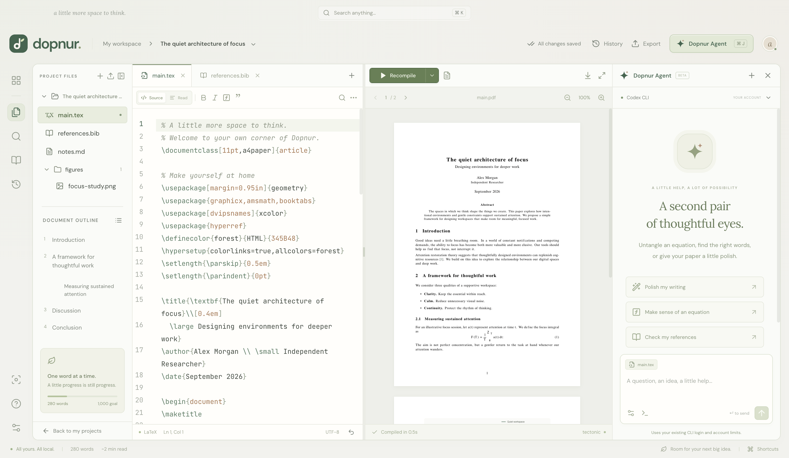

# Dopnur Agent

An optional assistant inside your LaTeX workspace. Ask for a clearer paragraph, help with an equation, or a proposed fix for a compilation error. Every proposed file change is reviewable before it reaches your project.

Open **Dopnur Agent → connection settings** and choose a connection.

| Connection  | Setup                                                                           | Usage                                                              |
| ----------- | ------------------------------------------------------------------------------- | ------------------------------------------------------------------ |
| Codex CLI   | Install Codex, run `codex login`, and choose Codex CLI                          | Reuses the CLI’s saved login; account limits and eligibility apply |
| Claude CLI  | Install Claude Code, sign in from its terminal interface, and choose Claude CLI | Reuses the CLI’s saved login; account limits and eligibility apply |
| API         | Set your base URL, API format, model name, and key                              | Your provider’s API billing applies                                |
| Local model | Use Chat Completions and a localhost endpoint, e.g. `http://localhost:11434/v1` | Depends on your local model server; a key is usually optional      |

CLI mode runs a background terminal process and exposes its progress in the run console. It does not require an API key supplied to Dopnur, and Dopnur removes inherited OpenAI/Anthropic API-key variables for these runs. It does not bypass provider authentication, entitlements, or usage limits. This version exposes an agent run console, not a general interactive terminal emulator.

The selected provider receives text files from the current project, the active selection, recent conversation, and compilation diagnostics when you send a request. Nothing is sent to an AI provider just by opening or editing a project. Large contexts are refused instead of silently truncating source. Requests may take up to four minutes.

The agent returns structured, complete replacement files. Dopnur validates the response, shows the diff, and applies only selected changes. If a file has changed since the proposal, the edit is rejected to preserve your work. Binary files, scripts, path traversal, hidden configuration files, and deletion proposals are not accepted. The agent has no direct editor write access. Secrets are encrypted using Electron’s OS-backed `safeStorage` and are never returned to the renderer.

Codex uses an isolated temporary working directory, read-only sandboxing, disabled shell tools, and no user configuration. Claude uses no tools or MCP servers and skips user/project setting sources. Dopnur supplies project context over stdin and never copies your CLI credentials. Live paid-provider runs require your own configured account; the automated end-to-end agent test uses a local mock API.

[Back to Dopnur](../README.md)
